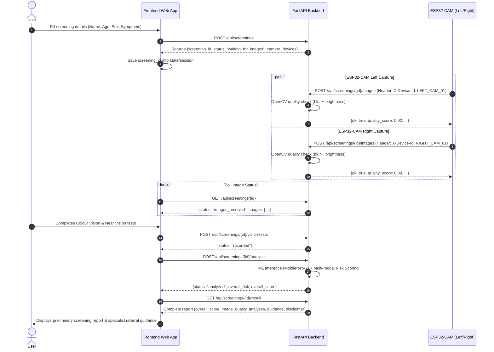

# EyeGUARDIAN Vision - Implementation Note: Frontend & Backend Integration

## 1. System Overview & Context

EyeGUARDIAN Vision is a prototype wearable preliminary eye-screening system. It utilizes dual ESP32-CAM (OV2640) sensor modules (`LEFT_CAM_01` and `RIGHT_CAM_01`) over Wi-Fi, paired with a Python FastAPI REST API backend, SQLite persistence, OpenCV image quality validation, TensorFlow/Keras MobileNetV2 transfer learning inference, and interactive vision tests (colour-vision and near-vision).

> [!IMPORTANT]
> **Safety & Medical Disclaimer**:
> This system is designed exclusively for **PRELIMINARY SCREENING**. All outputs, scores, classifications, and messages are non-diagnostic software risk indicators ("preliminary screening", "possible abnormality", "risk indicator", "may require professional assessment"). It must never present an ML prediction as a medical diagnosis or make clinical treatment decisions.

---

## 2. Frontend Architecture & Flow

The external frontend application connects as a web client (typically hosted at `http://localhost:3000`).

### Integration Sequence


---

## 3. Backend Architecture

- **Web Framework**: FastAPI with Pydantic v2 schemas and Uvicorn ASGI server.
- **Database**: SQLite with SQLAlchemy 2.0 ORM (`screenings`, `eye_images`, `vision_tests`, `analyses` tables).
- **Quality Checking**: OpenCV (Laplacian variance for blur detection, grayscale intensity mean for brightness exposure).
- **ML Inference**: TensorFlow/Keras 2.17 MobileNetV2 transfer learning on 224x224 RGB inputs. Includes non-crashing fallback (`ML_MODEL_NOT_READY`) if weights are missing.
- **Scoring & Risk Engine**: Multi-modal scoring combining image quality, ML prediction, color-vision score, near-vision score, and reported symptoms into a prototype software score (0-100) and risk tier (`low`, `attention`, `uncertain`).
- **Firmware**: Arduino C++ for AI-Thinker ESP32-CAM + OV2640 camera streaming multipart JPEGs with `X-Device-Id` headers.

---

## 4. API Endpoints & Contracts

| Endpoint | Method | Purpose | Key Parameters / Headers |
|---|---|---|---|
| `/api/health` | GET | Health and version verification | None |
| `/api/screenings` | POST | Initialize screening session | Body: `user_name`, `age`, `sex`, `symptoms` |
| `/api/screenings/{id}` | GET | Poll screening & camera status | Path: `screening_id` |
| `/api/screenings/{id}/images` | POST | Upload camera frame | Header: `X-Device-Id: LEFT_CAM_01` / `RIGHT_CAM_01`, Form: `file` (JPEG) |
| `/api/screenings/{id}/vision-tests` | POST | Save interactive vision test results | Body: `color_answers`, `near_answers`, `color_score`, `near_vision_score` |
| `/api/screenings/{id}/analyse` | POST | Trigger ML inference & risk scoring | Path: `screening_id` |
| `/api/screenings/{id}/result` | GET | Retrieve full screening report | Path: `screening_id` |

---

## 5. Repository File Structure

```text
eyeguardian_backend/
├── app/
│   ├── main.py
│   ├── config.py
│   ├── database.py
│   ├── models.py
│   ├── schemas.py
│   ├── routes/
│   │   ├── health.py
│   │   └── screenings.py
│   └── services/
│       ├── image_quality.py
│       ├── ml_service.py
│       └── scoring.py
├── ml/
│   ├── train.py
│   └── evaluate.py
├── models/
│   ├── .gitkeep
│   ├── external_eye.keras
│   └── class_names.json
├── data/
│   ├── external_eye/
│   └── screenings/
├── firmware/
│   └── esp32_cam.ino
├── scripts/
│   ├── test_api.py
│   └── seed_sample_data.py
├── tests/
│   ├── conftest.py
│   └── test_api.py
├── requirements.txt
├── .env.example
├── .gitignore
├── IMPLEMENTATION_NOTE.md
└── README.md
```
